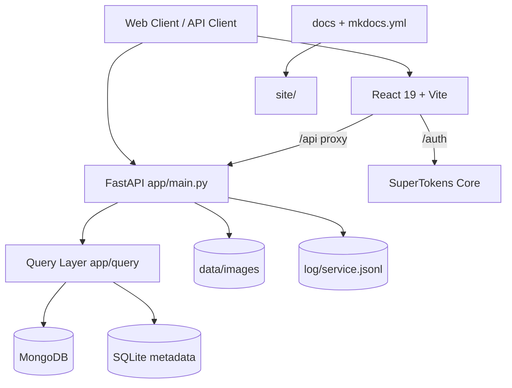

# 칵테일 메이커 (Cocktail Maker)

> FastAPI + React 기반의 한국어 칵테일 재료/레시피 관리 시스템으로, 재료 데이터 관리와 메타데이터 검증을 한 번에 제공합니다.


## Table of Contents

<!-- auto-generated TOC -->

- [개요](#개요)
- [아키텍처](#아키텍처)
  - [시스템 다이어그램](#시스템-다이어그램)
- [기술 스택](#기술-스택)
- [프로젝트 구조](#프로젝트-구조)
- [주요 기능](#주요-기능)
- [시작하기](#시작하기)
  - [사전 요구사항](#사전-요구사항)
  - [환경 변수](#환경-변수)
  - [설치](#설치)
  - [실행](#실행)
- [API 레퍼런스](#api-레퍼런스)
- [테스트](#테스트)
- [배포](#배포)
- [설계 패턴 및 컨벤션](#설계-패턴-및-컨벤션)
  - [코드 컨벤션](#코드-컨벤션)
- [문제 해결](#문제-해결)
- [기여하기](#기여하기)
- [로드맵](#로드맵)
- [라이선스](#라이선스)

## 개요

이 프로젝트는 주류(Spirits), 리큐르(Liqueur), 기타 재료(Ingredient), 칵테일(Cocktail) 데이터를 통합 관리하는 풀스택 애플리케이션입니다.
핵심 목적은 다음과 같습니다.

- 재료 등록/검색/수정/삭제 API 제공
- 맛/향/여운 메타데이터를 SQLite 기준값으로 검증해 데이터 일관성 유지
- 이미지 업로드(최대 2MB)와 로컬 파일 저장 파이프라인 제공
- SuperTokens 기반 세션 인증 및 React 보호 라우트 제공

주요 사용 대상:

- 칵테일 데이터 운영/관리자
- 바텐딩 학습/실험 사용자
- 칵테일 도메인 API를 확장하려는 개발자

## 아키텍처

### 엔트리 포인트

- Backend API: `app/main.py` (`cocktail_maker` FastAPI 앱)
- Frontend: `src/main.tsx`
- Production Server: `Dockerfile` → `gunicorn main:cocktail_maker --config app/gunicorn.conf.py`
- 문서 사이트: `mkdocs.yml` + `docs/` → `site/`
- 보안 정적 분석 스크립트: `codeql.sh`

### 핵심 컴포넌트

- **API 계층**: FastAPI 라우터(`/api/v1`) + 예외 핸들러(RFC 9457)
- **인증 계층**:
  - 기본: SuperTokens (`/auth/*`, 세션 기반)
  - 레거시(Deprecated): JWT (`/api/v1/auth/*`, `/api/v1/api-keys`)
- **쿼리 계층**: `app/query/query_parents.py`의 추상 클래스(`CreateDocument`, `RetrieveDocument`, `SearchDocument`) + 구현체(`queries.py`)
- **스토리지 계층**:
  - MongoDB: 주류/리큐르/기타재료/칵테일/유저 문서
  - SQLite(SQLModel): 메타데이터(`metadata` 테이블)
- **파일 계층**: `data/images/<collection>/<document_id>/...`
- **관측성 계층**: `structlog` JSONL 로그(`log/service.jsonl`), `?profile=true` 프로파일링

### 설계 패턴 및 트레이드오프

- **Query/Repository 유사 패턴**: 공통 CRUD/검색 로직 재사용, 엔티티별 구현 분리
- **Dual-DB 패턴**: MongoDB 유연성 + SQLite 검증 일관성
- **Middleware 중심 횡단 관심사 처리**: CORS/압축/헤더/예외/프로파일링 분리
- **트레이드오프**: DB가 이원화되어 운영 복잡도는 증가하지만, 메타데이터 품질 제어가 쉬워짐

### 데이터 흐름

1. 클라이언트(React/외부 API)가 `/api/v1/*` 또는 `/auth/*` 호출
2. FastAPI가 Pydantic 모델/Form으로 입력 검증
3. 메타데이터 값은 SQLite 기준값(`MetadataValidation`)으로 검증
4. Query 계층이 MongoDB 문서 저장/조회
5. 이미지가 있으면 로컬 파일 저장 후 문서 이미지 경로 갱신
6. 응답은 `return_formatter(status, code, data, message)`로 표준화 반환
7. 에러는 `problem_details_formatter()`로 RFC 9457 형식 반환

### 시스템 다이어그램



## 기술 스택

| Layer       | Technology                                           | Purpose                      |
| ----------- | ---------------------------------------------------- | ---------------------------- |
| Runtime     | Python 3.13+, Bun 1.2.15                             | 백엔드/프론트 실행           |
| Backend     | FastAPI, ORJSON, Uvicorn/Gunicorn                    | API 서버 및 고성능 JSON 응답 |
| Frontend    | React 19, TypeScript, Vite(Rolldown), TailwindCSS v4 | SPA UI 및 번들링             |
| Auth        | SuperTokens, (Legacy) PyJWT                          | 세션 인증 + 레거시 JWT       |
| Database    | MongoDB, SQLite(SQLModel)                            | 문서 저장 + 메타데이터 검증  |
| Query       | pymongo async client, SQLModel                       | 비동기 DB 접근 추상화        |
| Logging     | structlog                                            | JSONL 구조화 로그            |
| Testing     | pytest, pytest-asyncio, pytest-cov, vitest           | 백엔드/프론트 테스트         |
| Lint/Format | Ruff, Pyrefly, Biome                                 | 정적분석/포맷/타입검사       |
| Docs        | MkDocs, mkdocstrings                                 | 문서 사이트 생성             |
| CI/CD       | GitHub Actions (`deploy.yaml`)                       | `site/` GitHub Pages 배포    |

## 프로젝트 구조

```text
cocktail-maker/
├── app/                           # FastAPI 백엔드
│   ├── main.py                    # API 엔트리 포인트
│   ├── auth/                      # SuperTokens 보조/레거시 JWT/API Key
│   ├── database/                  # MongoDB/SQLite 커넥터 및 테이블
│   ├── model/                     # Pydantic/Form/TypedDict 모델
│   ├── query/                     # CRUD/검색/메타데이터 쿼리 계층
│   ├── utils/                     # 응답 포맷/로그/시간 유틸
│   └── gunicorn.conf.py           # 운영 서버 튜닝
├── src/                           # React 프론트엔드
│   ├── App.tsx                    # 라우팅 및 보호 라우트 구성
│   ├── components/                # 화면 컴포넌트(가이드/대시보드/등록 폼)
│   ├── hooks/                     # API/메타데이터/테마 훅
│   ├── contexts/                  # Theme Context
│   └── types/                     # 폼 타입 정의
├── tests/                         # pytest 테스트
├── docs/                          # MkDocs 원본 문서
├── compose/                       # Docker Compose 템플릿(운영/개발 인프라)
├── data/                          # 이미지 저장 루트
├── log/                           # 서비스 로그 JSONL 출력
├── schema/                        # JSON Schema 샘플
├── .github/workflows/deploy.yaml  # GitHub Pages 배포 워크플로우
├── Dockerfile                     # 앱 이미지 빌드
├── pyproject.toml                 # Python 의존성 및 툴 설정
├── package.json                   # 프론트 스크립트/의존성
└── mkdocs.yml                     # 문서 사이트 설정
```

> 참고: `compose/docker-compose-full-example.yaml`은 Compose 스펙 예시 성격이 강한 파일입니다.

## 주요 기능

- [x] 주류(Spirits) CRUD + 검색 + 페이지네이션
- [x] 리큐르(Liqueurs) CRUD + 검색
- [x] 기타 재료(Ingredients) CRUD + 검색
- [x] 칵테일 등록(`POST /api/v1/cocktails`) 및 재료 레시피 참조 업데이트
- [x] SQLite 기반 메타데이터 등록/조회/삭제
- [x] 이미지 업로드 검증(형식/2MB 제한) 및 로컬 저장
- [x] 표준 응답 포맷 + RFC 9457 오류 응답
- [x] SuperTokens 인증 라우트(`/auth/*`) + 보호 라우트(SessionAuth)
- [x] 구조화 로그 + 요청 프로파일링(`?profile=true`)

## 시작하기

### 사전 요구사항

- `Python >= 3.13`
- `uv` (버전 고정 없음, 최신 권장)
- `bun = 1.2.15` (packageManager 기준)
- `Docker` / `Docker Compose` (선택)

### 환경 변수

이 저장소에는 `.env.example`이 없습니다.
코드상 필수 키는 아래와 같습니다 (`environ[...]` 참조).

| Variable                | Required | Default | Description                        |
| ----------------------- | :------: | ------- | ---------------------------------- |
| `MONGODB_URL`           |    ✅    | —       | MongoDB 연결 URI                   |
| `SQLITE_PATH`           |    ✅    | —       | SQLite 파일 경로                   |
| `SUPERTOKEN_API_KEY`    |    ✅    | —       | SuperTokens API 키(환경 변수 읽음) |
| `SECRET_KEY`            |    ✅    | —       | 레거시 JWT 서명 키                 |
| `SECRET_ALGORITHM`      |    ✅    | —       | 레거시 JWT 알고리즘                |
| `PUBLIC_API_MASTER_KEY` |    ✅    | —       | API 키 파생 마스터 키(hex)         |
| `PUBLIC_API_SALT`       |    ✅    | —       | API 키 파생 솔트(hex)              |

```bash
cat <<'ENV' > app/.env
MONGODB_URL=mongodb://localhost:27017
SQLITE_PATH=../db.sqlite3
SUPERTOKEN_API_KEY=change-me
SECRET_KEY=change-me
SECRET_ALGORITHM=HS256
PUBLIC_API_MASTER_KEY=hex-64bytes
PUBLIC_API_SALT=hex-64bytes
ENV
```

### 설치

```bash
git clone https://github.com/dongju93/cocktail-maker.git
cd cocktail-maker

# Python dependencies
uv sync

# Frontend dependencies
bun install
```

### 실행

```bash
# Backend (dev)
uv run uvicorn app.main:cocktail_maker --reload --host 127.0.0.1 --port 8000

# Frontend (dev, new terminal)
bun run dev

# Docs (optional)
uv run mkdocs serve -a 127.0.0.1:9000
```

```bash
# Frontend production build
bun run build

# Backend production-like run
cd app
gunicorn main:cocktail_maker --config gunicorn.conf.py
```

```bash
# Docker image
docker build -t cocktail-maker:dev .
docker run --rm --env-file app/.env -p 8000:8000 cocktail-maker:dev

# Development infra (MongoDB + SuperTokens + Postgres)
docker compose -f compose/cocktail-maker-background/docker-compose.yaml up -d

# Swarm-oriented compose template
docker compose -f compose/cocktail-maker/docker-compose.yaml up
```

## API 레퍼런스

- OpenAPI(Swagger): `http://127.0.0.1:8000/api/docs`
- ReDoc: `http://127.0.0.1:8000/api/redoc`
- Base URL: `http://127.0.0.1:8000/api/v1`

### 엔드포인트 요약

| Module                   | Endpoints                                                                                                                                 |
| ------------------------ | ----------------------------------------------------------------------------------------------------------------------------------------- |
| Health                   | `GET /health`                                                                                                                             |
| Spirits                  | `POST /spirits`, `GET /spirits`, `GET /spirits/{name}`, `PUT /spirits/{document_id}`, `DELETE /spirits/{id}`                              |
| Liqueurs                 | `POST /liqueurs`, `GET /liqueurs`, `GET /liqueurs/{name}`, `PUT /liqueurs/{document_id}`, `DELETE /liqueurs/{document_id}`                |
| Ingredients              | `POST /ingredients`, `GET /ingredients`, `GET /ingredients/{name}`, `PUT /ingredients/{document_id}`, `DELETE /ingredients/{document_id}` |
| Cocktails                | `POST /cocktails`                                                                                                                         |
| Metadata                 | `POST /metadata/{kind}/{category}`, `GET /metadata/{kind}/{category}`, `DELETE /metadata/{id}`                                            |
| Legacy Auth (Deprecated) | `POST /auth/users`, `POST /auth/sessions`, `POST /auth/tokens`, `GET /auth/session`, `POST /api-keys`                                     |
| SuperTokens              | `/auth/*` (recipe routes via middleware)                                                                                                  |

### 대표 요청/응답

```bash
curl "http://127.0.0.1:8000/api/v1/health"
```

```json
{
  "status": "success",
  "code": 200,
  "data": { "status": "ok" },
  "message": "Service is running"
}
```

```bash
curl "http://127.0.0.1:8000/api/v1/spirits?pageNumber=1&pageSize=10"
```

```json
{
  "status": "success",
  "code": 200,
  "data": {
    "totalPage": 0,
    "currentPage": 1,
    "totalSize": 0,
    "currentPageSize": 0,
    "items": []
  },
  "message": "Successfully search spirits"
}
```

## 테스트

```bash
# Backend: pytest + coverage + HTML report
TIMESTAMP=$(date +%Y%m%d-%H%M%S) && uv run pytest -s --cov=app --html=tests/results/test-${TIMESTAMP}.html --self-contained-html

# Python lint / format / type check
uvx ruff check --fix app/
uvx ruff format app/
uvx pyrefly check app/

# Frontend lint / format / tests
bun run lint
bun run format
bun run test
```

테스트 전략:

- `tests/test_health_check.py`: 헬스체크 안정성/동시성(TaskGroup)
- `tests/test_error_response.py`: RFC 9457 오류 응답 형식
- `tests/test_encryption.py`: 암호화 유틸 일관성
- `tests/test_liqueur_delete.py`: 리큐르 삭제 API 예외/성공 시나리오

## 배포

### 배포 대상

- **애플리케이션**: Docker 이미지 + Gunicorn/FastAPI
- **리버스 프록시 템플릿**: `compose/cocktail-maker/nginx.conf`
- **문서 사이트**: GitHub Pages (`site/`)

### CI/CD

- `.github/workflows/deploy.yaml`
  - 트리거: `main` 브랜치 push
  - 동작: `peaceiris/actions-gh-pages@v4`로 `site/` 디렉터리 배포

### 환경별 차이

- **개발(로컬)**: `uvicorn --reload` + `bun run dev` + Vite `/api` 프록시
- **운영(앱)**: Dockerfile CMD의 Gunicorn (`app/gunicorn.conf.py`)
- **운영(네트워크)**: `compose/cocktail-maker/`의 Nginx TLS 종단 템플릿
- **스테이징**: 저장소 내 별도 스테이징 구성은 명시되어 있지 않음

## 설계 패턴 및 컨벤션

| Pattern                    | Where Used                                           | Rationale                                 |
| -------------------------- | ---------------------------------------------------- | ----------------------------------------- |
| Query/Repository 유사 패턴 | `app/query/query_parents.py`, `app/query/queries.py` | 데이터 접근 공통화, 구현체 분리           |
| Dual Database              | `app/database/connector.py`, `app/query/metadata.py` | 유연한 문서 저장 + 엄격한 메타데이터 검증 |
| Middleware 패턴            | `app/main.py`                                        | CORS/압축/헤더/예외/프로파일링 분리       |
| 표준 응답 포맷             | `app/utils/etc.py`                                   | 클라이언트 응답 구조 일관성               |
| RFC 9457 Problem Details   | `problem_details_formatter` + exception handlers     | 오류 응답 표준화                          |

### 코드 컨벤션

- Python
  - Ruff: line length 88, double quote
  - Pyrefly 타입 검사 사용
- Frontend
  - Biome: 2-space indent, single quote, lineWidth 100
  - TypeScript strict mode
- 패키지 매니저
  - Python: `uv`
  - JavaScript: `bun`
- 커밋 메시지 규칙
  - 저장소 내 별도 명시 문서 없음

## 문제 해결

- **서버 시작 시 KeyError 발생**
  - `app/.env`에 필수 환경변수 누락 여부 확인
- **인증 관련 오류**
  - SuperTokens Core(`http://localhost:3567`) 실행 여부 확인
- **MongoDB 연결 실패**
  - `MONGODB_URL` 및 MongoDB 인스턴스 상태 확인
- **프론트에서 API 호출 실패**
  - `bun run dev` 실행 시 Vite 프록시(`/api` → `127.0.0.1:8000`) 확인
- **문서/API 경로 혼동**
  - 백엔드 라우트 기준으로는 `/liqueurs`, `/ingredients`(복수형) 사용
- **성능 병목 분석**
  - 요청 URL에 `?profile=true` 추가

## 기여하기

현재 루트에 `CONTRIBUTING.md`는 없습니다.

권장 흐름:

1. `main`에서 브랜치 생성
2. 변경 후 품질 체크 실행
3. Pull Request 생성 및 리뷰 반영

```bash
uvx ruff check --fix app/
uvx ruff format app/
uvx pyrefly check app/
bun run lint
bun run format
uv run pytest tests/ --cov=app
```

## 로드맵

우선 순위 선정 기준

- 현재 구현 여부
- 이 앱의 핵심 목적과의 적합성
- 운영 안전성 및 유지보수 비용
- 기존 FastAPI + React + SuperTokens 구조와의 연결성 |

### 높은 우선순위

#### 1. 탐색/조회 경험 완성

- [ ] **재료/칵테일 검색 화면 추가**
  - 주류, 리큐르, 기타 재료, 칵테일 목록/상세 페이지 추가
  - 검색, 필터, 페이지네이션을 프론트에서 실제 사용 가능하게 연결
  - 프론트 훅과 백엔드 쿼리 파라미터 규약 일치화
- [ ] **칵테일 관리 UI 추가**
  - 이미 존재하는 칵테일 등록/조회/수정/삭제 API를 프론트에서 노출
  - 레시피 재료 선택기와 제조 단계 편집 UI 제공
  - 대시보드/가이드의 더미 데이터를 실제 데이터 흐름으로 교체

#### 2. 재료-칵테일 연결 기능 제품화

- [ ] **재료 상세에서 사용된 칵테일 목록 조회**
  - 특정 주류/리큐르/재료를 사용하는 칵테일 목록 반환
  - 주재료/보조재료 구분 정보 노출
- [ ] **보유 재료 기반 추천**
  - 사용자가 가진 재료 목록으로 제조 가능한 칵테일 추천
  - 부족한 재료 수 기준 정렬
  - 대체 재료 제안은 2단계로 분리
- [ ] **대시보드용 보유 재료 모델 정리**
  - 사용자별 보유 재료 저장 구조 정의
  - 추천/즐겨찾기/대시보드가 공통으로 참조하도록 설계

#### 3. 권한 및 운영 안전성 강화

- [ ] **쓰기 엔드포인트 인증 일관화**
  - 메타데이터 등록/삭제, 재료 등록/수정/삭제의 보호 범위 재정리
  - `verify_session` 기반 보호와 관리자/운영자 권한 분리
- [ ] **레거시 JWT 표면 축소**
  - deprecated 경로 유지 범위를 명시
  - SuperTokens 이후 기준 인증 흐름 문서화
- [ ] **운영 감사 로그 추가**
  - 메타데이터 변경, API 키 발급, 삭제 작업에 대한 감사 로그
  - 누가 언제 무엇을 변경했는지 추적 가능하게 정리

### 중간 우선순위

#### 4. 검색 품질 개선

- [ ] **정렬/필터 일관성 개선**
  - 이름순 외 정렬 옵션 추가
  - 엔티티별 검색 파라미터와 응답 포맷 일관화
- [ ] **한국어 검색 품질 향상**
  - 초성 검색 또는 정규화 기반 한글 검색 검토
  - 별도 엔드포인트 추가보다 공통 검색 전략 우선 검토
- [ ] **검색 사용성 개선**
  - 최근 검색, 자주 쓰는 필터, 빈 결과 처리 UX 개선

#### 5. 개인화 기능 최소 단위 도입

- [ ] **즐겨찾기**
  - 칵테일/주류 즐겨찾기 추가 및 조회
- [ ] **개인 컬렉션**
  - 공개 공유가 아닌 개인 저장 중심의 레시피 컬렉션
- [ ] **실데이터 기반 대시보드**
  - 더미 통계 대신 즐겨찾기 수, 보유 재료 수, 추천 수 등 실제 지표 반영

#### 6. 파일 및 배포 스토리지 확장

- [ ] **이미지 최적화 파이프라인**
  - 썸네일/중간 크기 생성
  - WebP 변환 및 메타데이터 정리
- [ ] **외부 스토리지 연동**
  - S3 또는 GCS 연동
  - CDN 서빙 및 URL 관리 전략 수립

#### 7. 운영 성능 관리

- [ ] **API 속도 제한**
  - 사용자/IP/API 키 단위 제한
- [ ] **캐싱**
  - 메타데이터 및 검색 결과 캐싱
- [ ] **모니터링**
  - 성능 메트릭, 에러 추적, 구조화 로그 정리

### 보류 또는 범위 재검토

#### 8. 이메일 인증 확장

- [ ] **필요 시에만 도입**
  - 공개 가입 정책이 정해질 때 이메일 검증 활성화 검토
  - 커스텀 인증 API 추가는 마지막 수단으로 유지

#### 9. 평점/리뷰/공개 레시피 공유

- [ ] **제품 방향이 커뮤니티형으로 바뀔 때 검토**
  - 평점 및 리뷰
  - 공개/비공개 레시피 공유
  - 추천 알고리즘 고도화

#### 10. 커뮤니티 게시판

- [ ] **현 단계에서는 착수하지 않음**
  - 게시판/댓글/좋아요/실시간 알림은 제품 방향 재합의 후 검토

### 구현 순서

1. **1단계**: 탐색/조회 UI 완성 → 칵테일 관리 UI → 권한 일관화
2. **2단계**: 재료-칵테일 연결 조회 → 보유 재료 기반 추천 → 대시보드 실데이터화
3. **3단계**: 검색 품질 향상 → 개인화 최소 기능 → 운영 성능 관리
4. **4단계**: 외부 스토리지, 이메일 검증 확장, 커뮤니티성 기능 여부 재판단

### 공통 체크리스트

- 기존 모델/쿼리 계층을 우선 재사용할 것
- 인증/권한 영향이 있으면 `verify_session` 및 역할 정책을 함께 설계할 것
- 프론트와 백엔드 파라미터/응답 계약을 동시에 검증할 것
- 기능 추가 시 테스트 또는 회귀 검증 경로를 함께 마련할 것
- README/OpenAPI/화면 흐름 문서를 구현 상태에 맞게 갱신할 것

## 라이선스

- 저장소 루트에 `LICENSE` 파일은 현재 없습니다.
- FastAPI 앱 메타데이터(`app/main.py`)에는 MIT 라이선스 정보가 선언되어 있습니다.
